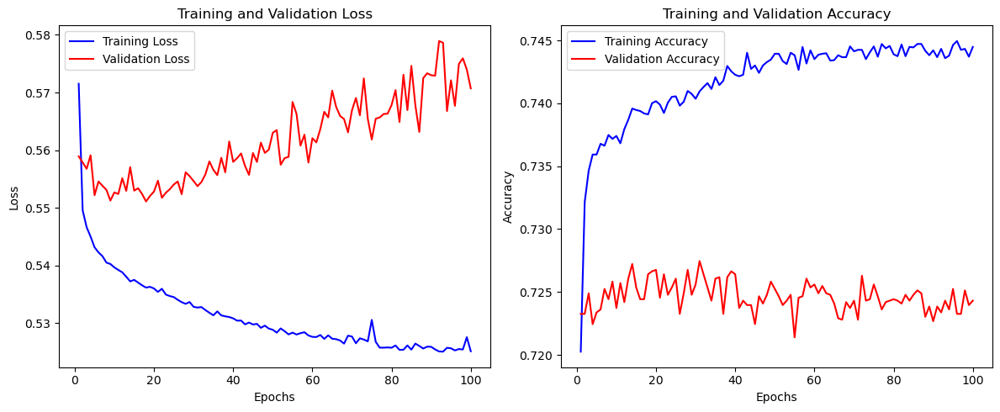

# Report on the Neural Network Model

## Overview of the Analysis

The purpose of this analysis is to develop a deep learning model using neural networks to predict the success of funding applications for Alphabet Soup, a charitable organisation. By leveraging historical data on funding applications and their outcomes, the goal is to create a predictive model that can accurately classify whether a new funding application is likely to be successful or not. This model aims to help Alphabet Soup allocate its resources more efficiently by focusing on applications with a higher likelihood of success.

## Results

### Data Preprocessing

- **Target Variable(s)**:
  - The target variable for the model is "IS_SUCCESSFUL," indicating whether a funding application was successful (1) or not (0).
- **Feature Variable(s)**:
  - Various factors related to the funding application, such as application type, organisation type, income amount, etc., serve as feature variables.
- **Variables Removed**:
  - The variables "EIN" and "NAME" were removed as they are neither targets nor features.

### Compiling, Training, and Evaluating the Model

- **Neurons, Layers, and Activation Functions**:
  - The model consists of multiple dense layers with varying numbers of neurons and ReLU activation functions. Specifically, it has:
    - One input layer with 128 neurons and ReLU activation.
    - Two hidden layers with 64 and 32 neurons, respectively, both using ReLU activation.
    - One output layer with 1 neuron and a sigmoid activation function.
  - This architecture was chosen to capture complex patterns in the data and provide sufficient capacity for learning.

#### Model Performance Analysis

The performance of the neural network model is detailed in the following graphs, which depict the model's training and validation loss and accuracy over 100 epochs:

- **Training and Validation Loss**:
  - The training loss shows a consistent decline, which indicates effective learning from the training data.
  - However, the validation loss initially decreases but then begins to fluctuate and rise, suggesting that the model may be overfitting to the training data.

- **Training and Validation Accuracy**:
  - The training accuracy improves significantly and stabilises, reflecting strong performance on the training data.
  - Conversely, the validation accuracy shows an initial increase followed by fluctuations, which further supports the potential overfitting issue.

### Achievement of Target Model Performance

- The model achieved an accuracy ranging from approximately 72% to 73% on the test set, which is close to the target performance.

### Steps Taken to Increase Model Performance

- During model development, various strategies were employed to enhance performance, including adjusting the number of layers, neurons, and activation functions, as well as optimising hyperparameters. Additionally, early stopping and model checkpointing were utilised to prevent overfitting and save the best model weights.

## Summary

In summary, the deep learning model developed for predicting funding application success demonstrated moderate performance, achieving an accuracy of around 72-73% on the test set. While this performance is acceptable, there is still room for improvement. To enhance model performance further, additional experimentation with different architectures, hyperparameters, and optimisation techniques could be beneficial. Alternatively, exploring ensemble methods or other machine learning algorithms, such as gradient boosting or random forests, may provide alternative solutions to the classification problem. These models could complement the neural network approach and potentially offer better predictive performance under certain circumstances.

